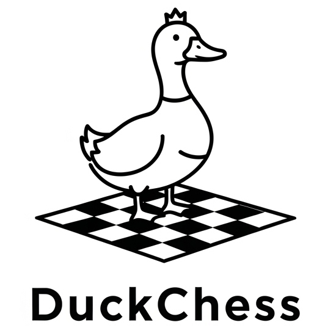

# DuckChess

[](https://github.com/trietvuive/DuckChess/actions/workflows/ci.yml)



A UCI chess engine written in Rust.

## Basic usage

You can use any chess UI that knows how to talk to engine with UCI. I use en-croissant, Chessifier (now [Pawn Appetit](https://github.com/Pawn-Appetit/pawn-appetit)) works as well. 
Play it on Lichess via https://lichess.org/@/DuckChessEngine!

### Running as a Docker container

```bash
cp .env.example .env
# Edit .env with your Lichess bot API token
docker compose up -d
```

The container builds the engine from source, bundles it with [lichess-bot](https://github.com/lichess-bot-devs/lichess-bot), and runs in the background. Use `docker compose logs -f` to watch output, `docker compose down` to stop.

## Opening book

The engine supports an opening book (PGN). Set the path with the UCI option **BookPath** and enable **OwnBook** (default: true). When the current position is in the book, the engine plays a random book move. Example: `opening_books/8moves_v3.pgn` (from [Stockfish books](https://github.com/official-stockfish/books)).